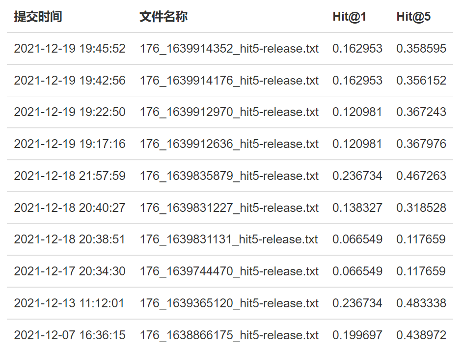
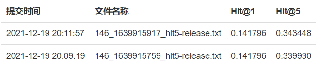
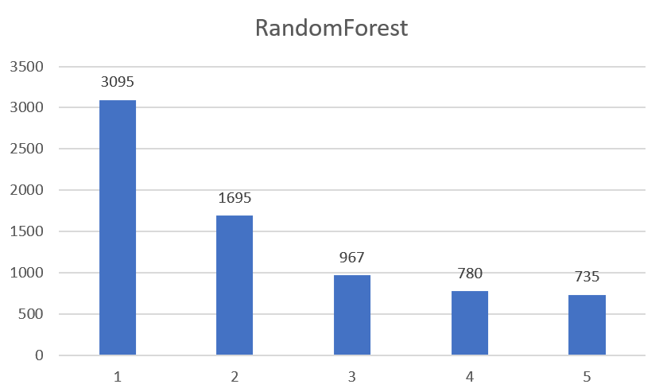

# Web信息处理与应用 Exp2 实验报告

USTChorusWeb2021
PB19000001 江小白
PB19051055 彭浩然

## 目录

[TOC]

## 关键提交记录

本次实验有以下几次具有代表性的提交，其中最佳结果为第一行的提交。

| 提交编号       | 别名                    | 提交hit5 | 提交hit1 | 本地hit5 | 本地hit1  |
| -------------- | ----------------------- | -------- | -------- | -------- | --------- |
| 176_1639365120 | TransE-100              | 0.483338 | 0.236734 | 0.537959 | 0.232919  |
| 176_1639744470 | Word2Vec-Naiive         | 0.117659 | 0.066549 | 0.100452 | 0.0563974 |
| 176_1639831227 | RandomForest            | 0.318528 | 0.138327 | 0.276176 | 0.117542  |
| 176_1639835879 | TransE-100+RandomForest | 0.467263 | 0.236734 | 0.516653 | 0.232919  |
| 146_1639915759 | TransE-1                | 0.339930 | 0.141796 | 0.344841 | 0.114808  |
| 146_1639915917 | TransE-1+RandomForest   | 0.343448 | 0.141796 | 0.343701 | 0.114808  |

所有提交的截图如下。有一些不具有代表性的提交并不在上面的列表中。

## 数据集划分与本地测试

### 数据集划分

数据集提供的已知三元组存在`train.txt`和`dev.txt`中，现将其混合为`all_triplets.txt`，并均分为11等份，分别称为`div0.txt`到`div10.txt`。其中，`div0.txt`到`div9.txt`共10个文件又被合并成`div0-9.txt`，一般用作训练集；`div10.txt`一般用作本地测试集，不参与任何训练。

### 本地测试

在任何一个模型的训练过程中，都涉及到一个“训练集”，一般是`div0-9.txt`。而在本地测试时，不但涉及到“测试集”，还涉及到“过滤集”。具体而言，测试集中的尾实体会对模型不可见，模型需要给出对尾实体的预测；但在输出前5个预测结果前，为了避免给出的预测结果是训练集中的已有结果从而降低命中率，会从原始的输出排序中过滤掉过滤集中已经出现的三元组。

在进行训练时，使用的训练集为`div0-9.txt`；进行本地测试时，使用的测试集为`div10.txt`，过滤集为`div0-9.txt`；进行最终结果导出时，使用的测试集为数据集原始提供的`test.txt`，过滤集为`all_triplets.txt`。

## 基于Word2Vec和关系向量平均的方法

### Word2Vec语义空间生成
对于每个实体，我们利用 `gensim.models` 库，使用Word2Vec方法将其文本描述信息中的每一个词（对应到数据集中的一个整数）对应转换成一个100维的向量。实体对应的向量为各词向量之和取平均值。这里，为了减少计算量，我们没有做归一化处理。

### 关系向量平均
为了计算关系向量，我们借鉴了TransE算法的思想。我们假设：在Word2Vec语义空间中，具有相同关系的实体对，对应的向量之差应该具有相似的形式。因此，对应的关系向量可以取为：
$$\vec{r}_k=\frac{1}{N}\sum_{i=1}^{N}(\vec{t}_i-\vec{h}_i)$$
上式中，$i$ 对每一个形式为 $<h_i,r_k,t_i>$ 的三元组的头尾实体向量之差求和。

计算出关系向量后，我们就能够利用

$$\vec{t}_{p}=\vec{h}+\vec{r}$$
预测对应的尾实体向量。对于向量空间的每一个尾实体 $\vec{t}$，我们用其与预测向量 $\vec{t}_{p}$ 的欧氏距离（的平方）作为其得分 `score`，取得分最低的前5作为最终预测的5个尾实体。

### 测试结果

| 提交编号       | 别名            | 提交hit5 | 提交hit1 | 本地hit5 | 本地hit1  |
| -------------- | --------------- | -------- | -------- | -------- | --------- |
| 176_1639744470 | Word2Vec-Naiive | 0.117659 | 0.066549 | 0.100452 | 0.0563974 |

可以看到，提交测试的hit5只有0.117659，是一个比较低的水平。回想在这个模型中对文本信息和关系信息的利用，我们可以发现最后的预测只依赖于Word2Vec向量空间中的距离远近，相当于将100维的向量先压缩到1维，再做比较，而无法对相对位置、方位等更多潜藏在高维向量空间中的信息加以有效利用。为了增大模型的自由度、更充分地挖掘当前的语义向量空间中的特征，我们考虑使用更加复杂的分类器模型对Word2Vec得到的向量进行后续处理。

## 基于Word2Vec和随机森林的方法

从测试结果中可以看出，简单地使用Word2Vec进行预测，效果并不十分理想。因此我们想到，可以利用随机森林的思想，通过对数据的随机抽样、对特征随机抽样并且平均各个树的预测，来降低预测结果的方差。

### 主成分分析降维
随机森林方法所需的时间代价较大，为了降低运行时间，我们想到利用 `sklearn` 库，使用主成分分析（PCA, Principal Component Analysis）的方法，对Word2Vec方法生成的100维向量进行维度归约。`sklearn.decomposition` 中的PCA方法（不同于老师上课所述的根据特征值分解矩阵）是通过SVD奇异值分解实现的。

经过对参数的调整，发现当降维至 `n_components = 64` 时，能够恰好使得各特征方差贡献率之和 `sum(explained_variance_ratio_)` 达到90%，且有效地降低随机森林算法的运行时间。

### 随机森林
使用 `sklearn.ensemble` 库中的 `RandomForestClassifier` 对模型进行训练：正样本来自于上述用PCA方法进行维数归约处理后的向量三元组，用1标记。负样本则通过随机生成来构建（当前三元组的头实体向量+关系向量+随机抽样尾实体向量），用0标记。

训练时采用的参数：
- `n_estimators = 100`，即随机森林中决策树总数目
- `criterion = "gini"`，即采用Gini不纯度作为衡量决策树分支的性能
- `max_features = sqrt(n_features)`，在决策树的每个节点处，考虑特征数的（平方根）子集作为拆分的标准

### 测试结果
| 提交编号       | 别名         | 提交hit5 | 提交hit1 | 本地hit5 | 本地hit1 |
| -------------- | ------------ | -------- | -------- | -------- | -------- |
| 176_1639831227 | RandomForest | 0.318528 | 0.138327 | 0.276176 | 0.117542 |

可以看出，基于Word2Vec和随机森林的方法相比纯Word2Vec的方法有较为显著的提升。仅基于文本信息和经过平均的关系向量对尾实体进行预测，在线测试结果可以达到 `hit@5 = 0.318528`，且比本地测试结果高出约5%。

## 基于TransE的方法

虽然已经达到了超过0.3的hit5率，但是前面两个模型对于图信息的利用仍然很不充分。随机森林中的100个决策树的数量甚至少于关系总数237，而除了这些决策树的参数外，所有几万条图信息仅仅被浓缩在了一个平均的关系向量中，也就是说，这个模型中来自图信息的参数相当少。为了更加充分地利用图信息，我们尝试采用OpenKE提供的TransE模型做尾实体预测。

### 对OpenKE的修改

OpenKE采用了Python前端、C++后端的模式实现，而其中的一些代码与我们的需求不完全重合。我们对其中的一些部分进行了修改：

- 经过程序分析，我们发现OpenKE虽然要求用户输入“验证集(valid)”，但却没有在任何地方使用，且对输出结果没有影响，所以我们将这一部分在输入中置空
- OpenKE在统计时只给出前1、3和10位命中的信息，且仅仅是统计，并不输出预测结果，因此我们修改为输出前5位命中的结果及其score，以便后续分析
- OpenKE默认对TransE方法进行1000个epoch的训练，而考虑到我们没有GPU算力，我们将其改为100个epoch，效果相对于理论极限并没有很大的下降

除此之外，其他参数均保持默认，例如采用200维的向量空间和基于 `MarginLoss` 的误差函数等。

### 测试结果

| 提交编号       | 别名       | 提交hit5 | 提交hit1 | 本地hit5 | 本地hit1 |
| -------------- | ---------- | -------- | -------- | -------- | -------- |
| 176_1639365120 | TransE-100 | 0.483338 | 0.236734 | 0.537959 | 0.232919 |

虽然TransE方法仅仅使用了图信息，完全没有使用文本信息，但是效果却远好于前面的两个方法。这可能是因为图信息更加结构化、比文本信息更“干净”。TransE语义空间的建构完全依赖于图信息，而不必受文本信息干扰，可以比前面两个方法更充分地捕捉图信息中的细节。

## 混合TransE与随机森林的方法

上面基于Word2Vec的两个方法对文本信息非常依赖，而为图信息留下的自由度较少；TransE方法则完全依赖图信息，没有利用任何文本信息。是否可以通过结合两种方法各自的优点，达到一个比任何单一方法更号的结果？我们对此做出了如下尝试。

### 对两种方法本地测试结果的实证分析

我们首先对目前最佳的TransE（TransE-100）和随机森林（RandomForest）的本地测试结果进行了一些实证分析，以证明这种做法的可行性。

#### 命中位置分布

两个方法的命中率都随着位置的递增而递减，也就是说，对于同一个三元组的预测，模型的排序确实可以反映置信程度。

#### 各位置命中的score分布

| 方法 / 平均score | 第1位命中   | 第2位命中   | 第3位命中   | 第4位命中   | 第5位命中   | 未命中      | 总体标准差  |
| ---------------- | ----------- | ----------- | ----------- | ----------- | ----------- | ----------- | ----------- |
| TransE-100       | 10.16878753 | 10.62999738 | 10.54967031 | 10.56142117 | 10.61581264 | 10.23285629 | 1.552880017 |
| RandomForest     | 0.006637303 | 0.007752605 | 0.011352809 | 0.015151282 | 0.016654163 | 0.043319227 | 0.050395911 |

可以看到，两种方法的命中位数和是否命中的score并没有非常明显的差异，尤其是考虑到这些微小差异在标准差面前的尺度，试图通过score来预测命中情况并不可行。

#### 命中重合

两种方法命中条目取并集后的总数为15151，命中条目取交集后的总数为6286，交-并比为0.414890106。这个数字高于随机命中情况下的交-并比，说明两种方法所命中条目拥有一定趋同的倾向。但即便如此，仍有剩下超过一半的条目并不重合。

### 基于bagging思想的融合方法

以上的实证分析给我们带来了一些启发：
- 两种方法的命中存在不重合的部分，将两者融合可以从多样性中获益
- 具体给出一条预测时，选择哪种方法应依赖于这种方法对自己结果的置信度，但从统计结果中看，这并不可行
- TransE的命中率普遍高于RandomForest，因此可以考虑将后者的结果作为前者的补充

我们提出以下的融合方法：
- 不在模型或者语义空间上做融合，而直接对输出结果进行融合（bagging方法）
- 将TransE的最后一位预测替换为RandomForest的第一位预测，如果与已有的前四位预测重复，则顺次取RandomForest的后几位预测

### 测试结果

#### 针对最佳结果的测试

| 提交编号       | 别名                    | 提交hit5 | 提交hit1 | 本地hit5 | 本地hit1 |
| -------------- | ----------------------- | -------- | -------- | -------- | -------- |
| 176_1639365120 | TransE-100              | 0.483338 | 0.236734 | 0.537959 | 0.232919 |
| 176_1639831227 | RandomForest            | 0.318528 | 0.138327 | 0.276176 | 0.117542 |
| 176_1639835879 | TransE-100+RandomForest | 0.467263 | 0.236734 | 0.516653 | 0.232919 |

对于两种方法最佳结果的融合并不理想。融合结果略低于纯TransE方法。可能有这些原因：
- 两种方法本身的命中率差异超过0.15，RandomForest即便是第一位也会拉低TransE第五位的命中率
- 两种方法的命中本身就有一些趋同的倾向，多样性带来的好处并不能弥补命中率的差异

#### 针对接近命中率结果的测试

为了屏蔽上述原因，测试融合方法本身的有效性，我们使用TransE模型进行一次轻度训练（1个epoch，向量空间维数降到64维），以得到一个命中率和RandomForest模型最佳结果相近的结果，与之进行融合。

| 提交编号       | 别名                  | 提交hit5 | 提交hit1 | 本地hit5 | 本地hit1 |
| -------------- | --------------------- | -------- | -------- | -------- | -------- |
| 176_1639831227 | RandomForest          | 0.318528 | 0.138327 | 0.276176 | 0.117542 |
| 146_1639915759 | TransE-1              | 0.339930 | 0.141796 | 0.344841 | 0.114808 |
| 146_1639915917 | TransE-1+RandomForest | 0.343448 | 0.141796 | 0.343701 | 0.114808 |

在这个情形下，融合方法的命中率比两种方法单独预测的命中率都高，证明了我们提出的融合方法的可行性。

## 总结

我们通过对各种模型的比较分析和综合运用，在TransE-100提交中达到了0.483338的hit5命中率，并证明了融合多种信息的方法可以在特定的情形下达到比单一信息方法更好的效果。总体而言，基于图信息的TransE方法比基于文本信息的Word2Vec系列方法结果更优。

